# GU Bulletin
This is a Flutter app for Galgotias University adminstrational updates                                                 

# Features
 1. Authentic login system using firebase (only used by organisation)
 2. Role based access
 3. Uploading images option through gallery
 4. Blogging app like and responsive ui
 5. Can detect location
 
# Screenshots

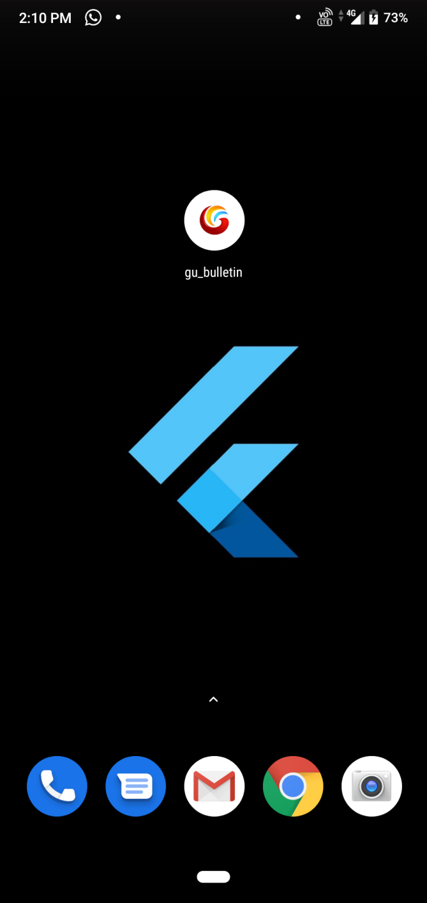  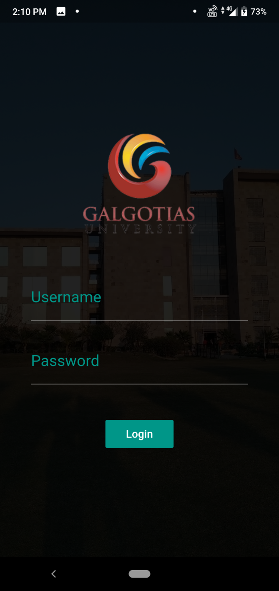  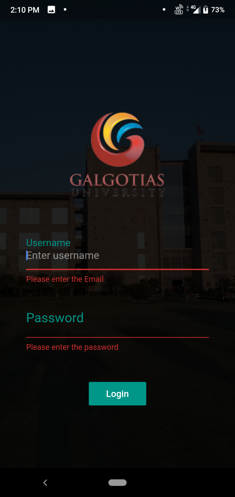  

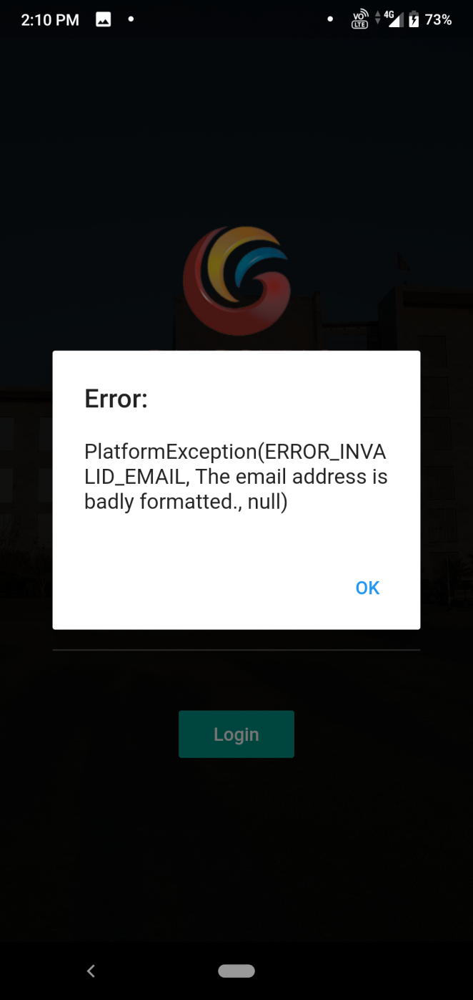  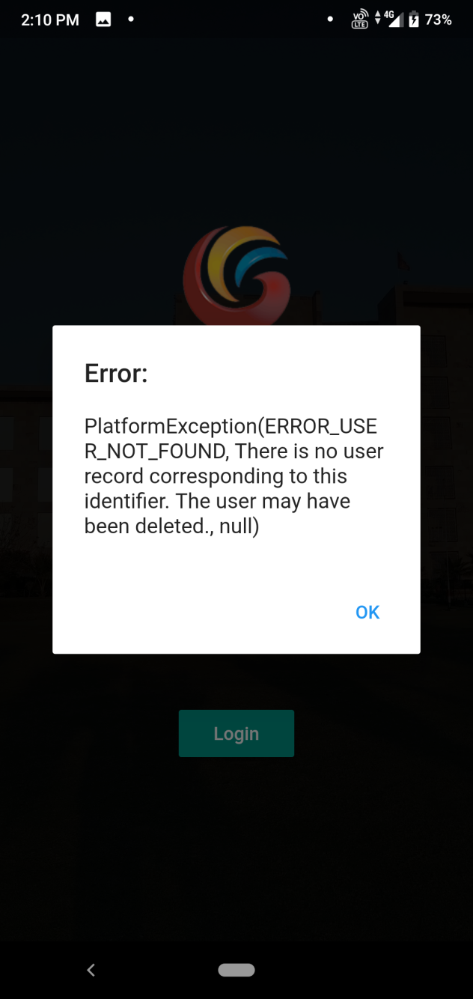  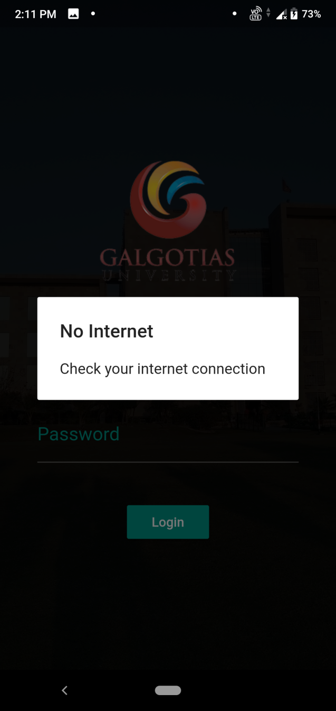  

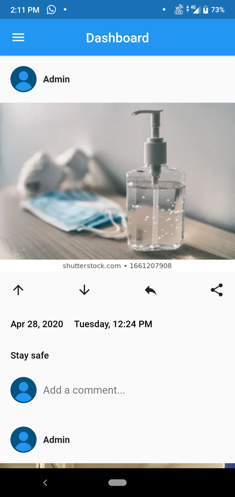  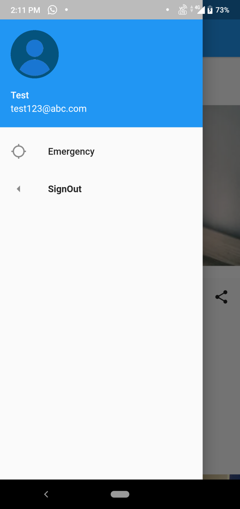  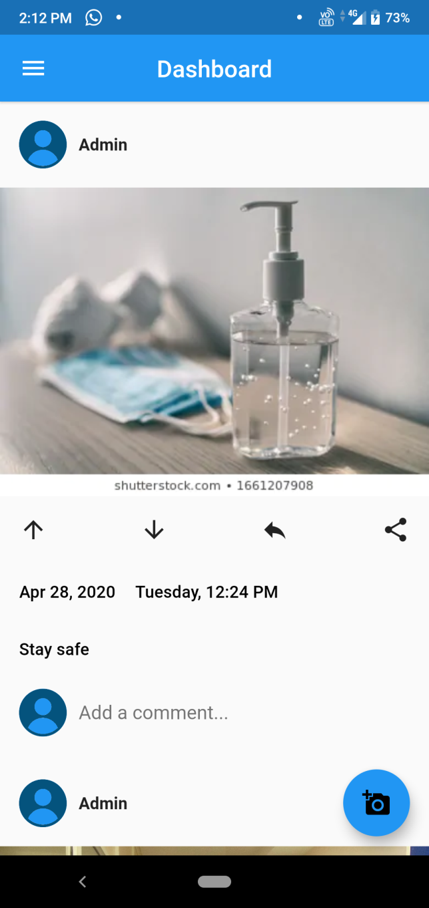

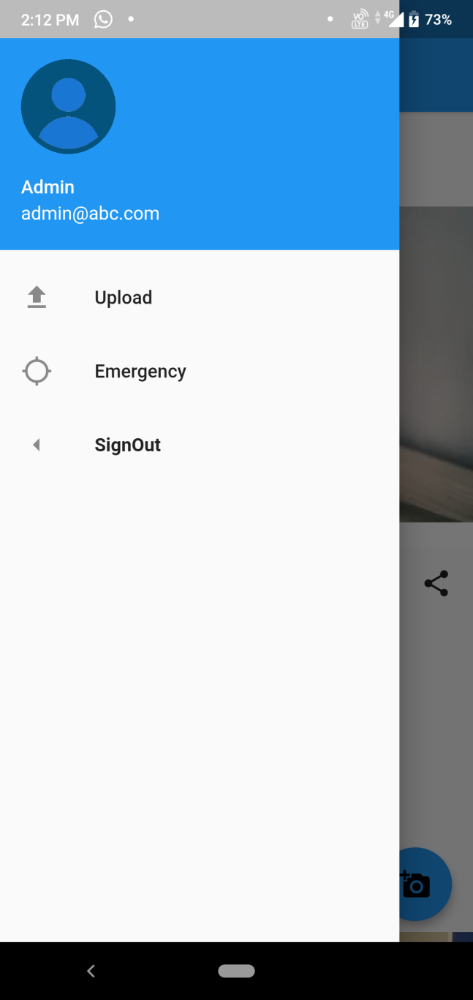  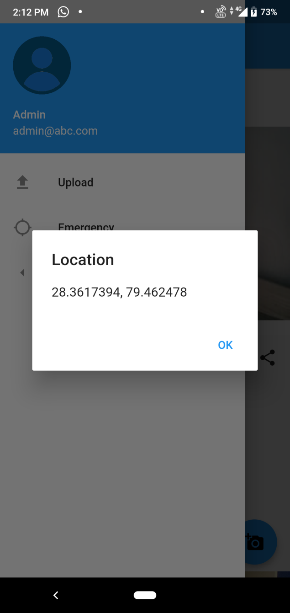  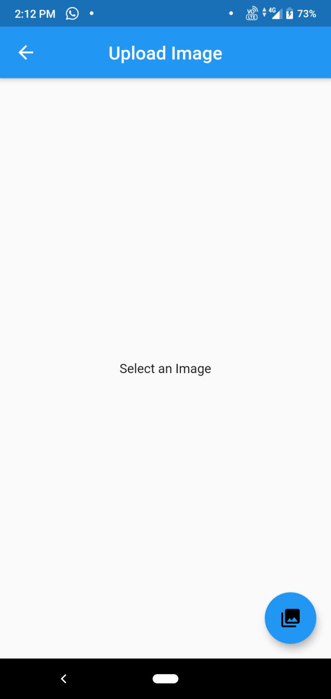

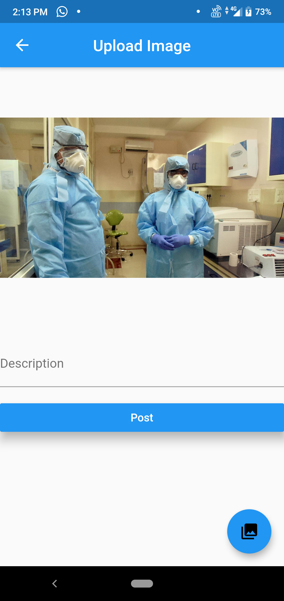

